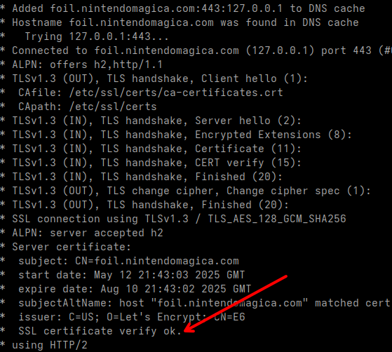

# Project Ownfoil

This is a custom Ownfoil made and documented by [Blog Anibal Copitan](https://blog.anibalcopitan.com/2025/05/configura-tu-servidor-de-juegos.html)
Review the content and adapt it to your needs.


## Config your local and router `expose the ports`

Exponer los puertos:  

    80 -> http (obligatorio abierto para **Caddy** auto SSL)
    443 -> https

First you need the `qt` package on your Raspberry:  

```bash
sudo apt install jq
sudo apt install cron # optional in raspbery already installed
```

## ⏰ Automatizar actualizar IP local inhose server 

(porque SiteGround no tiene servidor dns dinamico)
Agrega este `./script.sh` a crontab:

```bash
crontab -e
```

Y pon:

```
*/5 * * * * /ruta/a/tu/script.sh
```

> Tu subdominio `foil.nintendomagica.com` siempre apuntará a tu IP pública, y se actualizará automáticamente cada 5 minutos.


## Iniciar ownfoil

```bash
git clone <repository-url>
cd custom-ownfoil
mv .env.example .env # Create a .env file and set the creddentials

docker-compose up -d
```

## Comando para ver el o los servicios

```bash
sudo docker compose ps
```

## Comando para dentener el servicio

```bash
sudo docker compose stop
```

## Comando para iniciar el servicio

```bash
sudo docker compose start
```

## Extra 1: re build contenedor:

Si agregaste cosas al docker-compose.yml puedes usar esto:

```bash
docker compose down # elimina contenedores antiguos
docker compose up -d # reconstruir contenedores
```

## Extra 2: debugging

En el archivo `docker-compose.yml` el `container_name` = `ownfoil`

```bash
docker compose logs -f ownfoil
docker exec -it ownfoil bash

# debuging no usar docker-compose restart ni  docker-compose up -d
# modificar /app/app.py 
docker restart ownfoil

```

### Extra 3: verificando si el certificado HTTPS 

```bash
curl -v https://foil.nintendomagica.com --resolve foil.nintendomagica.com:443:127.0.0.1
```




<!--  X-Forwarded-Proto header. -->

### todo on local and pro

- [x] Ejecutar script en servidor
- [x] Configurar en cron el script.sh
- [x] Iniciar docker compose
    `docker-compose up -d`
- [x] Configurar Proxy reverso con **[Caddy](https://caddyserver.com/)** Easy
    - [x] Exponer puertos: `80` & `443` en ISP o router
    - [x] Testear estas configs
- [x] Test prueba: acceder desde: `https://foil.nintendomagica.com`


**Notes:**
 - To connect from nintendo swich device not connect using: `https://foil.nintendomagica.com`
 - Altenative soluciones:
    - Need to test: config in my self subdomain `https://foil.anibalcopitan.com`
    - Need to test: config in my seft subdomain but by HTTP
    - Create or use VPS for to get Up the project
        - without restriction of router or ISP
        - Need to config HDD in `media` on VPN by VPN or another like tunnel